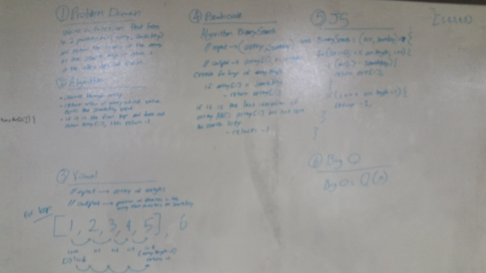

# Binary Search

## Challenge
Write a function that takes 2 parameters, an array and a searchKey, and return the index of the array whose value is equal to the searchKey OR if there are no elements in the array that are equal to the searchKey, return -1.  

## Solution
