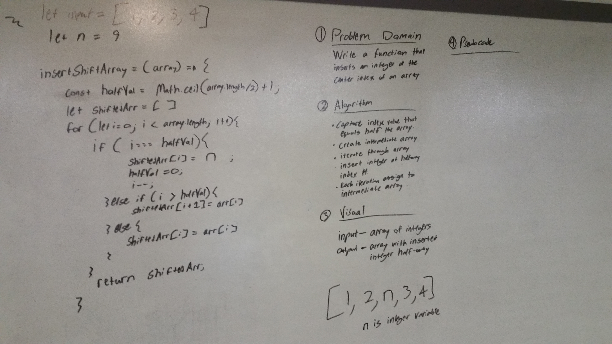

# Insert and shift middle index of array
Insert an integer at the center index of an array and return the array, without the use of built-in array methods.

## Challenge
Create a function that inserts an integer at the center index of an array and return the array, without the use of built-in array methods.

## Solution
